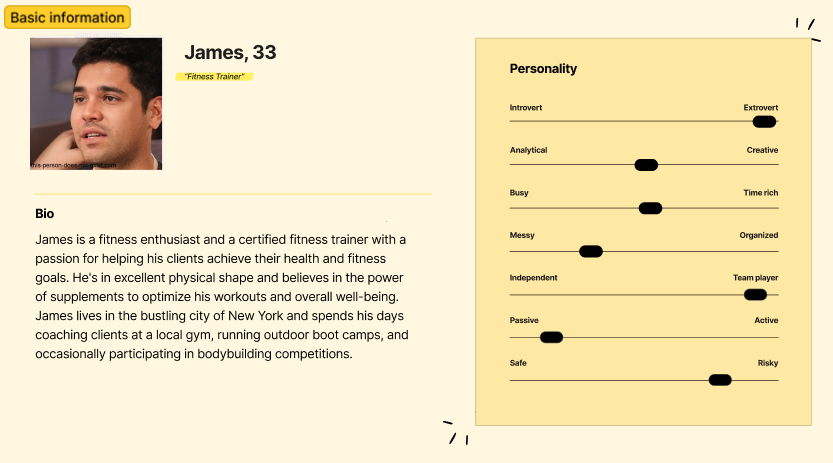

# Class-project 2:

User personas and informational architecture for a web shop selling supplement products. Created using ChatGPT

# 1. User Personas

> _Develop 3 varying user personas for a new web application that sells supplement products_

# 2. **Information Architecture and Card Sorting**

> _What is information architecture in UX design? What is a cart sorting method in UX design?_

> _Propose a set of card topics related to web page for supplement products_

Information architecture (IA) in UX design is the practice of organizing, structuring, and labeling content on a website or application to enhance user understanding and facilitate efficient navigation. It involves creating a clear hierarchy, categorizing content, and providing users with a logical and intuitive way to find information.

Card sorting is a user research method in UX design where participants organize and categorize content or topics into groups based on their perception and understanding. This method helps designers understand how users mentally structure information and can be used to improve the navigation and organization of a website or application

**Homepage**

- Header with logo, navigation menu, and user login/registration options
- Hero section with a brief value proposition and an option to start a personalized supplement journey

**Product Listings**

- Grid view of product cards with product images, names, prices, and average ratings
- Comparison tool between products+

**Cart and Checkout**

- Cart summary with product details, quantities, and subtotal

**About Us**

- Information about the company, mission, and values

**Contact Us**

- Contact form with fields for name, email, subject, and message

**Privacy Policy and Terms of Service**

- Links to privacy policy, terms of service, and legal disclaimers

**Login and Registration**

- Options to log in or register for a new account

**User Profile**

- User account details and settings
- Order history and tracking

# 3. Sitemap

Sitemap created using gloomaps

